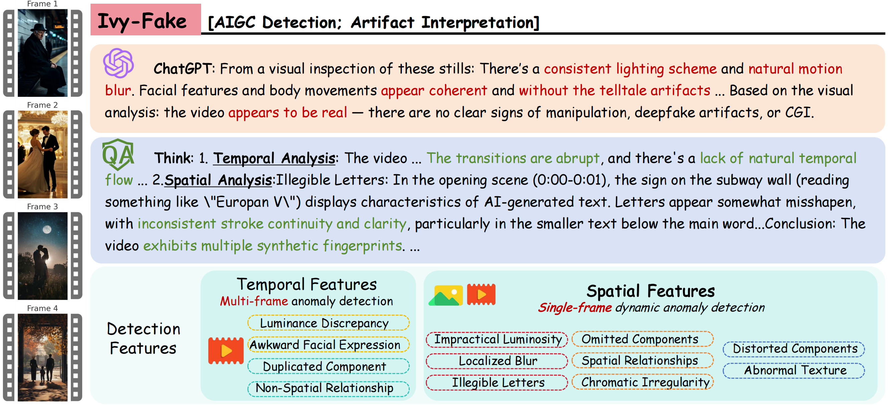

# Ivy-Fake: A Unified Explainable Framework and Benchmark for Image and Video AIGC Detection

[](https://arxiv.org/abs/2506.00979) [](https://huggingface.co/datasets/AI-Safeguard/Ivy-Fake) [](https://huggingface.co/AI-Safeguard/Ivy-Fake) [](https://github.com/Pi3AI/Ivy-Fake) [](http://creativecommons.org/licenses/by-sa/4.0/)


**Ivy-Fake** is a novel, unified, and large-scale dataset specifically designed for **explainable multimodal AI-Generated Content (AIGC) detection**. It represents the first large-scale benchmark covering both images and videos for this purpose.

Alongside the dataset, we introduce **Ivy-XDetector**, a unified vision-language model (VLM) that achieves state-of-the-art performance in detecting and explaining AI-generated media by identifying complex temporal and spatial artifacts.

## 📅 Timeline

- **March 2026**: Presentation at **ICMR 2026 Conference**
- **Oct 2025**: Public release of the **dataset and model** on HuggingFace
- **June 2025**: Released the first version of **Ivy-Fake** on arXiv

---

## 🏗️ Project Overview

The Ivy-Fake framework analyzes temporal and spatial artifacts to enable transparent detection. The **IVY-XDETECTOR** follows a three-stage progressive training pipeline:

1. **General Video Understanding:** Building fundamental spatiotemporal comprehension.
2. **AIGC Detection Fine-tuning:** Specializing the model for binary discrimination (Real vs. Fake).
3. **Joint Optimization:** Aligning detection accuracy with high-quality natural language explainability.
---

## 🚀 Getting Started

### 1. Resource Links

| Resource | URL |
| --- | --- |
| **Dataset** | [Hugging Face Datasets](https://huggingface.co/datasets/AI-Safeguard/Ivy-Fake) |
| **Model** | [Hugging Face Models](https://huggingface.co/AI-Safeguard/Ivy-Fake) |
| **Code** | [GitHub Repository](https://github.com/Pi3AI/Ivy-Fake) |

### 2. Inference Example

The following snippet demonstrates how to perform inference using our model with the `transformers` library.

```python
import torch
from transformers import Qwen2_5_VLForConditionalGeneration, AutoProcessor
from qwen_vl_utils import process_vision_info

# Initialize Model and Processor
model_id = "AI-Safeguard/Ivy-Fake"
model = Qwen2_5_VLForConditionalGeneration.from_pretrained(
    model_id,
    torch_dtype=torch.bfloat16,
    attn_implementation="flash_attention_2",
    device_map="auto",
)
processor = AutoProcessor.from_pretrained(model_id)

# Define the Detection Prompt
messages = [
    {
        "role": "system",
        "content": "You are an AI-generated content detector. Classify the media as real or fake. Provide reasoning inside <think>...</think> tags. End with exactly one word—real or fake—wrapped in <conclusion>...</conclusion>."
    },
    {
        "role": "user",
        "content": [
            {
                "type": "image",
                "image": "https://path-to-your-image.jpg", # Replace with your media path
            },
            {"type": "text", "text": "Is this image real or fake?"},
        ],
    }
]

# Preparation for Inference
text = processor.apply_chat_template(messages, tokenize=False, add_generation_prompt=True)
image_inputs, video_inputs = process_vision_info(messages)
inputs = processor(
    text=[text],
    images=image_inputs,
    videos=video_inputs,
    padding=True,
    return_tensors="pt",
).to("cuda")

# Generation
generated_ids = model.generate(**inputs, max_new_tokens=2048, do_sample=False)
generated_ids_trimmed = [
    out_ids[len(in_ids) :] for in_ids, out_ids in zip(inputs.input_ids, generated_ids)
]
output_text = processor.batch_decode(
    generated_ids_trimmed, skip_special_tokens=True, clean_up_tokenization_spaces=False
)

print(output_text[0])

```

---

## 📝 Citation

If you find Ivy-Fake or IVY-XDETECTOR useful in your research, please cite:

```bibtex
@article{jiang2025ivy,
  title={Ivy-fake: A unified explainable framework and benchmark for image and video aigc detection},
  author={Jiang, Changjiang and Dong, Wenhui and Zhang, Zhonghao and Si, Chenyang and Yu, Fengchang and Peng, Wei and Yuan, Xinbin and Bi, Yifei and Zhao, Ming and Zhou, Zian and others},
  journal={arXiv preprint arXiv:2506.00979},
  year={2025}
}
```